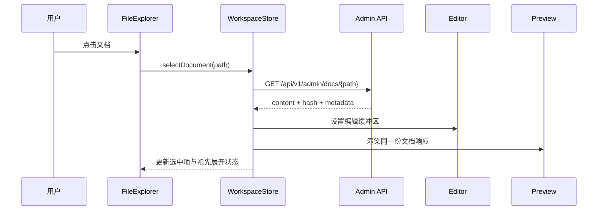

# 管理端工作区设计与开发规划

文档状态：P0–P3 首轮已实现，P4–P5 待实施
日期：2026-09-06  
视觉基准：已选择的图二方案（左侧文件树 + 中央编辑器 + 右侧预览）  
参考产品：Obsidian、思源笔记、Typora

本轮执行记录：管理端已切换到图二的三栏工作区，完成文件树、上下文新建菜单、文档标签、中央 Markdown 编辑器、实时安全预览、属性面板、未保存状态和旧后端目录接口 404 的路径降级。P3 已加入文档移动、复制、目录移动、空目录删除及树和标签联动；文档重命名、并发冲突和发布状态仍按后续阶段推进。

## 1. 目标与边界

当前管理页把目录配置、文档列表和文档编辑器按纵向堆叠在同一条页面流中。用户必须先经过目录设置表单，再在页面下方寻找文档列表和正文编辑区；目录、文档和编辑动作没有形成稳定的空间关系，导致“我正在编辑什么”“保存会影响什么”“新建按钮会创建什么”都不够明确。

本次规划把管理端改造成一个长期驻留的工作区：

```text
工作区顶栏
├─ 左：工作区 / 文件树 / 搜索 / 新建
├─ 中：文档标签页 / Markdown 编辑器
└─ 右：实时预览 / 当前文档属性 / 历史入口
```

目标是缩短以下核心闭环：

```text
找到文档 → 打开文档 → 编辑 → 预览 → 保存 → 继续切换文档
```

目录设置、重命名、移动、删除等结构操作属于“内容组织”，通过文件树的上下文菜单或属性面板触发，不再占据编辑器上方的大块纵向空间。

本阶段只规划管理端工作区，不新增多用户权限、实时协作、块编辑器、数据库视图或同步服务。

## 2. 第一性原理：界面对象与操作对象一一对应

管理端只有四类核心对象：

| 对象 | 用户心智模型 | 持久化事实 | 主要界面位置 |
|---|---|---|---|
| 工作区 | “我在哪个知识库里” | 站点配置、工作区视图状态 | 顶栏与左侧栏 |
| 目录 | “文档放在哪里” | 真实文件夹与 `_category.yml` | 左侧文件树、目录上下文菜单 |
| 文档 | “我正在编辑哪一篇” | Markdown 文件及路径 | 文件树、标签页、编辑器 |
| 文档属性 | “这篇文档如何展示和归类” | Front Matter、分类路径、排序元数据 | 右侧属性面板 |

每个动作只改变一个主要对象，并明确其副作用：

- “新建文档”创建一个 Markdown 文件，并自动打开它。
- “新建目录”创建文件夹和可选的 `_category.yml`，不自动创建文档。
- “重命名”修改显示标题或文件路径时，必须明确区分两者。
- “移动”修改文档路径，同时刷新树、当前标签、面包屑和链接预览。
- “保存”写入 Markdown 与 Front Matter，不承担目录管理职责。
- “预览”只切换视图，不触发保存。
- “更多”承载低频结构操作，不把低频操作常驻成一排按钮。

## 3. 调研结论

### 3.1 Obsidian：工作区是可组合的布局，不是单一页面

Obsidian 官方把桌面工作区拆成左侧 Ribbon、可折叠左右侧栏、侧栏标签组，以及中央可拆分的标签页区域；布局状态本身是工作区的一部分。[Workspace](https://obsidian.md/help/workspace)

文件树的常用动作围绕当前上下文展开：顶端可以新建笔记或文件夹，右键目录可以在该目录内创建，文件和目录还支持重命名、删除、拖放移动等操作。[File explorer](https://obsidian.md/help/Plugins/File%2Bexplorer)

属性不被强行塞进编辑正文。Properties view 同时支持查看当前文件属性和全库属性，属性还能成为搜索入口。[Properties view](https://obsidian.md/help/plugins/properties)

Obsidian 的核心启发是：

1. 侧栏负责“找到对象”。
2. 中央区域负责“处理对象”。
3. 属性和低频动作放在可折叠的辅助视图。
4. 标签页、侧栏和命令入口让用户在同一工作区连续工作，不必反复回到管理首页。

### 3.2 Typora：编辑器优先，文件操作围绕当前文件夹

Typora 提供文件树、文件列表和大纲三类侧栏视图；文件操作包括打开、新窗口、新建文件/文件夹、复制、重命名、删除、移动和复制路径。[File Management](https://support.typora.io/File-Management/)

Typora 会监听打开文件夹的变化并自动刷新文件树；如果自动刷新异常，提供手动刷新入口。[File Management](https://support.typora.io/File-Management/)

大纲由当前文档的标题层级推导，点击大纲项跳转到标题，并在滚动或编辑时标记当前标题。[Outline / Catalog](https://support.typora.io/Outline/)

Typora 还把 Focus Mode 和 Typewriter Mode 作为编辑体验，而不是额外的内容模块：前者降低其他段落的视觉干扰，后者保持当前行在视口中间。[Focus and Typewriter Mode](https://support.typora.io/Focus-and-Typewriter-Mode/)

Typora 的核心启发是：

1. 编辑器是主任务，文件管理是围绕编辑器的辅助层。
2. 大纲和预览属于当前文档的派生视图，不应与全局目录混为一谈。
3. 文件操作应保持接近真实文件系统语义，并提供变化后的刷新机制。

### 3.3 思源笔记：层级、数据源和索引必须有边界

思源官方文档将工作区描述为自描述的目录树：笔记本、文档和资源落在磁盘上，目录结构表达文档层级，索引数据库是可重建的派生数据。[Workspace file-system layout](https://github.com/siyuan-note/siyuan/blob/master/docs/WORKSPACE.zh-CN.md)

思源 API 将笔记本和文档的创建、重命名、删除、移动、排序拆成独立操作，并明确了路径、父节点和排序值的语义。[API.zh-CN.md](https://github.com/siyuan-note/siyuan/blob/master/docs/API.zh-CN.md)

思源 README 还把多标签、拖放拆分屏、块级编辑、大文档处理列为编辑器能力。[README.zh-CN.md](https://github.com/siyuan-note/siyuan/blob/master/README.zh-CN.md)

思源的核心启发是：

1. 文件系统是内容事实源时，索引只能服务查询，不能成为另一份正文。
2. 移动、排序、重命名必须是有明确输入输出的独立命令。
3. 层级关系要由稳定 ID 或安全路径表达，不能依赖显示标题猜测。

### 3.4 共同规律

三个产品虽然编辑模型不同，但都遵循同一条规律：

```text
稳定工作区
  → 上下文文件树
  → 当前文档单一主编辑区
  → 当前文档的预览/大纲/属性派生视图
  → 低频动作进入上下文菜单或命令入口
```

这正是图二方案比当前纵向表单更适合本项目的原因。

## 4. 图二方案的目标布局

### 4.1 顶栏

顶栏保持 56–64px，固定在工作区顶部，只放全局动作：

| 控件 | 作用 | 状态反馈 |
|---|---|---|
| 工作区名称 | 显示当前站点/知识库 | 下拉可进入站点设置，第一版可只读 |
| 全局搜索 / 命令入口 | 搜索文档或执行低频命令 | `Ctrl/Cmd + K` 打开 |
| 同步/保存状态 | 表示当前文档是否有未保存修改 | 已保存、保存中、保存失败、冲突 |
| 预览切换 | 显示/隐藏右侧预览 | 编辑、分栏、仅预览 |
| 更多 | 低频工作区动作 | 设置、刷新索引、退出登录 |
| 保存/发布 | 当前文档的主动作 | 保存成功后更新时间和状态更新 |

顶栏不放目录字段、标题输入框或长段说明，避免让全局操作和当前文档操作混在一起。

### 4.2 左侧内容导航

左侧宽度建议 260–300px，独立滚动，分为三层：

1. **快速入口**：全部文档、最近编辑、收藏（收藏后置，第一版可隐藏）。
2. **目录树**：真实目录、展开状态、当前目录/文档选中态。
3. **底部设置**：站点设置和退出登录，不与内容操作混排。

左侧只处理选择和组织，不承载正文编辑。目录行使用悬停出现的 `…` 菜单，默认保持干净。

### 4.3 中央编辑区

中央区域是唯一的主编辑表面：

```text
标签页行
  当前路径 / 文档状态
  标题
  Markdown 编辑器
  底部状态栏（字数、行列、Markdown、保存状态）
```

编辑器第一版继续使用 Markdown 源码文本框，先完成稳定的标签页、未保存状态、快捷键和保存冲突处理，再评估 CodeMirror 6。编辑器不直接负责目录、权限或站点设置。

### 4.4 右侧预览与属性

右侧默认显示当前文档的安全 HTML 预览，宽度建议 360–440px；在窄屏上改为抽屉或标签页。

右侧顶部提供两个视图：

- **预览**：展示与阅读端一致的 Markdown 渲染结果。
- **属性**：编辑标题、描述、目录归属、排序、草稿/公开状态等元数据。

属性视图只编辑结构化字段；正文仍在中央编辑器中。这样可以避免把 YAML 和正文同时暴露成两套容易互相覆盖的编辑入口。

## 5. 新增按钮的操作契约

按钮不是装饰元素。每个按钮必须对应一个命令、一个状态变化和一个可验证的持久化结果。

| 按钮/入口 | 当前对象 | 前端动作 | 后端动作 | 成功后联动 |
|---|---|---|---|---|
| 新建 ▼ | 当前目录 | 打开菜单，选择“新建文档/新建目录” | `POST /api/v1/admin/docs` 或 `POST /api/v1/admin/categories` | 更新树，打开新文档或选中新目录 |
| 新建文档 | 目录 | 打开轻量命名弹窗，默认继承当前目录 | 创建 Markdown 和 Front Matter | 树新增节点，中央打开新标签，进入未保存/已创建状态 |
| 新建目录 | 目录/工作区根 | 输入路径、显示名、描述 | 创建目录与 `_category.yml` | 树刷新，选中目录，属性面板显示目录设置 |
| 搜索/命令 | 工作区 | 打开可键盘操作的命令面板 | 搜索走现有搜索 API；命令调用对应管理 API | 选中文档、执行动作或显示错误 |
| 文件树文档行 | 文档 | 选中并打开/切换标签 | `GET /api/v1/admin/docs/{path}` | 中央编辑器、右侧预览、标签和状态同步 |
| 文件树目录行 | 目录 | 展开/收起；点击选中目录 | 读取已加载树；设置保存时调用分类 API | 目录上下文改变，新建默认位置改变 |
| 目录 `…` | 目录 | 打开上下文菜单 | 重命名/移动/删除/设置分别调用独立 API | 树、文档路径、当前标签、搜索结果刷新 |
| 文档 `…` | 文档 | 打开上下文菜单 | 重命名/移动/复制链接/删除 | 更新文件树、标签、路径预览、相邻文档 |
| 预览 | 当前文档 | 切换右侧预览显示 | 无 | 只改变工作区视图状态，不写文件 |
| 属性 | 当前文档 | 切换右侧属性表单 | 修改后调用文档元数据保存 API | 预览、树标题、搜索摘要按需刷新 |
| 保存并发布 | 当前文档 | 校验、提交、显示保存状态 | 原子写入 Markdown；更新发布元数据 | 更新 ETag、预览、树、公共阅读端缓存 |
| 保存 ▼ | 当前文档 | 展开“保存草稿/保存并发布”等动作 | 按生命周期写入 | 明确区分草稿和公开状态 |
| 标签页关闭 | 文档标签 | 检查未保存修改 | 无；确认后关闭本地标签 | 恢复上一个标签或空状态 |
| 分栏/全屏 | 工作区视图 | 改变布局 | 持久化到浏览器工作区偏好 | 刷新后恢复布局，不影响内容 |

### 5.1 “新建”按钮的默认位置

新建动作必须有上下文：

- 在工作区顶栏点击“新建”，默认使用当前选中的目录。
- 在目录 `…` 菜单点击“新建文档”，强制使用该目录。
- 在没有选中目录时，使用文档根目录。
- 新建文档成功后立即打开，避免创建后还要在长列表中寻找。
- 名称冲突由服务端返回结构化错误；前端保留用户输入，不静默改名。

这借鉴了 Obsidian“在指定目录右键新建”的语义，同时保留本项目 Markdown 文件路径是事实源的约束。

### 5.2 “目录设置”不再是常驻大表单

目录设置通过目录行的 `…` 菜单进入右侧属性面板或轻量弹层，字段分为：

- 基础：目录路径、显示名称、描述。
- 展示：排序、阅读页默认折叠。
- 结构动作：新建子目录、重命名、移动、删除。

保存只更新当前目录的 `_category.yml`。如果路径发生变化，必须把“路径移动”和“显示名修改”分成两个明确动作，防止用户误以为改标题会移动文件夹。

## 6. 状态模型与组件联动

### 6.1 工作区状态

```ts
type WorkspaceState = {
  activePath: string | null;
  openPaths: string[];
  activePanel: 'preview' | 'properties';
  leftSidebarOpen: boolean;
  rightSidebarOpen: boolean;
  expandedDirectories: Set<string>;
  selectedDirectory: string | null;
};
```

内容状态和视图状态分开：

- 内容状态来自 API 和磁盘：文档正文、哈希、路径、目录元数据。
- 视图状态来自浏览器：打开标签、面板开关、展开目录、编辑器滚动位置。
- 未保存状态来自当前编辑缓冲区：`clean`、`dirty`、`saving`、`saved`、`conflict`、`error`。

### 6.2 组件责任

| 组件 | 只负责 | 不负责 |
|---|---|---|
| `AdminWorkspace` | 工作区布局、面板开关、全局状态编排 | 直接写文件 |
| `WorkspaceHeader` | 搜索、命令、保存状态、视图切换 | 解析 Markdown |
| `FileExplorer` | 目录树、选择、展开、上下文菜单 | 保存正文 |
| `DocumentTabs` | 打开、切换、关闭标签 | 修改文件内容 |
| `MarkdownEditor` | 编辑缓冲区、快捷键、脏状态 | 决定文件路径 |
| `DocumentPreview` | 渲染当前文档 HTML | 写入文档 |
| `DocumentProperties` | 编辑结构化属性 | 拼接整篇 Markdown |
| `CommandPalette` | 搜索并分发已注册命令 | 自己实现业务副作用 |

所有写入动作经由 `adminApi`，组件不直接拼接 URL 或重复处理 ETag。

### 6.3 选择一篇文档后的事件流



### 6.4 保存事件流

```text
编辑输入
  → dirty
  → 本地预览即时更新
  → 用户点击保存或触发明确的防抖保存
  → If-Match 使用加载时 hash
  → 服务端原子写入
  → 返回新 hash
  → 更新标签、树、预览和公共缓存
```

第一版建议手动保存为权威动作，可提供 800–1200ms 防抖的本地预览；自动写盘要等冲突、离开页面和失败重试策略稳定后再开启。

## 7. 后端接口路线

当前后端已有管理员文档 CRUD、分类读取/写入和 P3 的基础结构操作接口；统一响应模型、路径重命名、冲突解决和发布状态仍按以下路线补齐：

### 7.1 保留并统一现有接口

```text
GET    /api/v1/admin/docs
GET    /api/v1/admin/docs/{path}
POST   /api/v1/admin/docs
PUT    /api/v1/admin/docs/{path}
DELETE /api/v1/admin/docs/{path}
GET    /api/v1/admin/categories
POST   /api/v1/admin/categories
```

文档响应至少包含：`path`、`title`、`description`、`content`、`hash`、`draft`、`updatedAt`。列表响应不返回正文。

### 7.2 增加结构化文件操作

```text
POST   /api/v1/admin/directories
PATCH  /api/v1/admin/directories/{path}
DELETE /api/v1/admin/directories/{path}
POST   /api/v1/admin/documents/{path}/move
POST   /api/v1/admin/documents/{path}/duplicate
POST   /api/v1/admin/documents/{path}/rename
POST   /api/v1/admin/tree/refresh
```

当前 P3 已落地的接口为：

```text
POST   /api/v1/admin/docs/move
POST   /api/v1/admin/docs/duplicate
POST   /api/v1/admin/categories/move
DELETE /api/v1/admin/categories/{path}
```

请求统一使用 `source_path`、`target_path` 和文档 `expected_hash`；服务端拒绝路径越界、符号链接逃逸、目标冲突以及递归删除非空目录。

也可以采用统一命令接口，但必须保持命令参数强类型，不能让前端上传任意文件系统路径：

```json
{
  "operation": "move_document",
  "sourcePath": "guides/old.md",
  "targetDirectory": "operations"
}
```

所有结构操作必须：

1. 经过同一套相对路径校验，拒绝 `..`、绝对路径、盘符、UNC 和符号链接逃逸。
2. 在服务端检查源存在、目标父目录存在和名称冲突。
3. 返回变更前后路径、受影响文档数量和新的树版本。
4. 让前端以服务端响应更新状态，不靠本地猜测。

### 7.3 原子写入与并发

文档保存继续使用 `If-Match`/ETag：

- 客户端加载 `hash=A`。
- 保存时携带 `If-Match: "A"`。
- 服务端发现磁盘已变为 `B` 时返回 `409 DOCUMENT_VERSION_CONFLICT`。
- 前端保留本地缓冲区，提供“查看服务器版本 / 覆盖保存 / 复制本地内容”三种选择。

移动、重命名和删除也应使用树版本或源哈希，避免两个浏览器同时操作造成路径覆盖。

## 8. 实施难点与坑

### 8.1 显示标题与文件路径不是同一件事

当前项目支持 Front Matter `title`，而文件路径决定 URL。编辑标题不应默认重命名文件，否则会破坏链接和外部书签。第一版将两者分开：

- 修改“页面标题”：更新 Front Matter。
- 修改“文件名/路径”：显式执行重命名或移动，并展示影响范围。

### 8.2 目录移动会影响所有派生入口

移动文档后必须同步更新：文件树、当前标签、URL、面包屑、前后篇、搜索结果、公共缓存和正文中的相对媒体引用。不能只在前端把节点换一个父节点。

### 8.3 `_category.yml` 是目录展示元数据，不是文档内容

目录标题、描述、排序和折叠状态写入 `_category.yml`；目录移动或删除必须决定该文件的移动、合并或删除策略。保存失败时不能只更新内存中的目录名。

### 8.4 编辑器与预览不能维护两份正文

中央编辑器的 Markdown 文本是当前修改源；右侧预览由同一份缓冲区派生。预览不得再次请求旧文件覆盖未保存输入，也不得把 HTML 反向写回 Markdown。

### 8.5 标签页会放大并发和离开页面问题

每个打开标签需要独立缓冲区、哈希和保存状态。关闭、切换、重命名时都要检查 `dirty`。第一版不做跨浏览器同步标签，只保存当前浏览器的布局偏好。

### 8.6 文件监听与用户保存可能互相竞争

外部文件变化应刷新树并标记当前文档“服务器已变化”，不能静默覆盖编辑器输入。用户保存完成后再合并监听事件，避免保存动作触发自己的重复加载。

### 8.7 权限与目录越界必须在服务端完成

按钮隐藏只能改善体验，不能代替鉴权。所有创建、移动、删除、附件访问和搜索结果都要重新检查管理员会话及路径边界。附件目录不能因为右侧预览而变成无鉴权静态目录。

### 8.8 移动端不能缩小三栏桌面布局

小于 1024px 时使用抽屉或面板切换：文件树、编辑器、预览三者同一时间只显示一个主面板；保留返回、保存和未保存提示。不要把三个面板压缩成不可操作的窄列。

## 9. 分阶段开发路线

### P0：契约和状态骨架

- 定义 `WorkspaceState`、文档缓冲区、保存状态和错误模型。
- 抽出 `adminApi`，统一路径编码、ETag、401/409/422 错误处理。
- 保留当前 API 行为，补充结构操作接口草案和响应类型。
- 写出文档标题/路径、目录元数据、草稿/公开状态的字段契约。

验收：不改变视觉前，所有组件可以用同一份类型和 API 契约通信。

### P1：工作区壳与文件树

- 将当前纵向 `admin-category-panel + admin-editor` 改为工作区布局。
- 实现左侧目录树、快速入口、当前选中态和展开状态。
- 将“新建文档/新建目录”改为带上下文的菜单。
- 实现文档标签页的打开、切换和关闭提示。

验收：用户可以在同一页完成“选择目录 → 新建文档 → 打开文档 → 切换另一篇”。

### P2：编辑器优先与预览

- 中央编辑区接入现有 Markdown 文本内容。
- 右侧预览复用阅读端同一套服务端渲染结果或安全渲染管线。
- 加入标题、路径、字数、保存状态和未保存离开提示。
- 先手动保存，预览支持即时更新；不要在此阶段加入复杂自动保存。

验收：编辑器和预览始终来自同一份当前缓冲区，保存后刷新不丢内容。

### P3：结构操作

当前已完成文档移动、复制、删除，目录移动和空目录删除，以及服务端目标冲突、路径边界、非空目录保护；文档显式重命名、目录重命名和树版本响应留在 P3 的下一小步。

- 实现目录/文档上下文菜单。
- 增加重命名、移动、复制、删除和刷新操作。
- 服务端返回变更前后路径和树版本，前端按响应重建局部树。
- 处理名称冲突、空目录、带附件文档和并发冲突。

验收：结构操作在真实 `/data/content` 中产生预期文件变化，重启容器后树和 URL 一致。

### P4：属性和发布状态

- 右侧属性面板编辑标题、描述、目录、排序和草稿/公开状态。
- 将 Front Matter 解析和写回集中到后端，避免前端字符串替换破坏 YAML。
- 预览和公共阅读端根据保存后的生命周期状态更新。

验收：修改标题不改变路径；显式重命名路径后所有关联入口同步更新。

### P5：可靠性、可访问性和响应式

- 处理外部文件变化、保存失败、版本冲突、网络中断和恢复。
- 完成键盘命令、焦点管理、抽屉、Escape 关闭和 200% 缩放。
- 桌面三栏、平板双栏、手机单面板测试。
- 增加 API 集成测试、组件状态测试和浏览器端到端测试。

验收：核心操作不依赖鼠标悬停；刷新、后退、断网恢复和容器重建都不静默丢数据。

## 10. 验收清单

### 核心任务

- [ ] 从文件树新建文档，默认放入当前目录并自动打开。
- [ ] 从目录上下文菜单新建子目录，保存 `_category.yml`。
- [ ] 在标签页之间切换，未保存文档有明确提示。
- [ ] 编辑 Markdown 时右侧预览即时跟随，预览不会覆盖编辑内容。
- [ ] 保存后返回新哈希，刷新页面内容一致。
- [ ] 重命名标题不改变 URL；重命名路径有独立确认。
- [ ] 移动文档后树、标签、面包屑、搜索和公共 URL 一致。
- [ ] 删除操作有明确对象和二次确认，失败时不从树中假删。

### 安全与数据

- [ ] 所有管理写入要求有效会话。
- [ ] 所有路径经过统一安全校验。
- [ ] `If-Match` 冲突不会覆盖他人或外部修改。
- [ ] Markdown、附件、搜索和预览使用同一权限边界。
- [ ] 数据始终写入宿主机绑定的 `/data/content`、`/data/media` 和数据库路径。

### 体验

- [ ] 常用动作在一到两次点击内完成。
- [ ] 低频动作只在上下文菜单或命令面板出现。
- [ ] 侧栏、预览和属性面板可独立折叠。
- [ ] 视图状态刷新后可恢复，内容状态以服务端为准。
- [ ] 移动端不出现三栏挤压和不可滚动的编辑器。

## 11. 当前版本的取舍

第一版不复制 Obsidian 的插件生态、图谱和多窗口，也不复制思源的块级数据库模型。项目继续以“Markdown 文件为正文事实源、SQLite 保存管理数据、Go 服务统一写入”为基础，只吸收成熟产品已经验证的工作区组织方式：稳定侧栏、当前文档主编辑区、可折叠预览/属性、上下文操作和明确的保存状态。

完成 P0–P2 后再评估是否需要 CodeMirror 6、标签系统、反链、大纲面板和自动保存。任何新增按钮都必须先补充本文件的“操作契约”与后端副作用，再进入 UI 实现。
